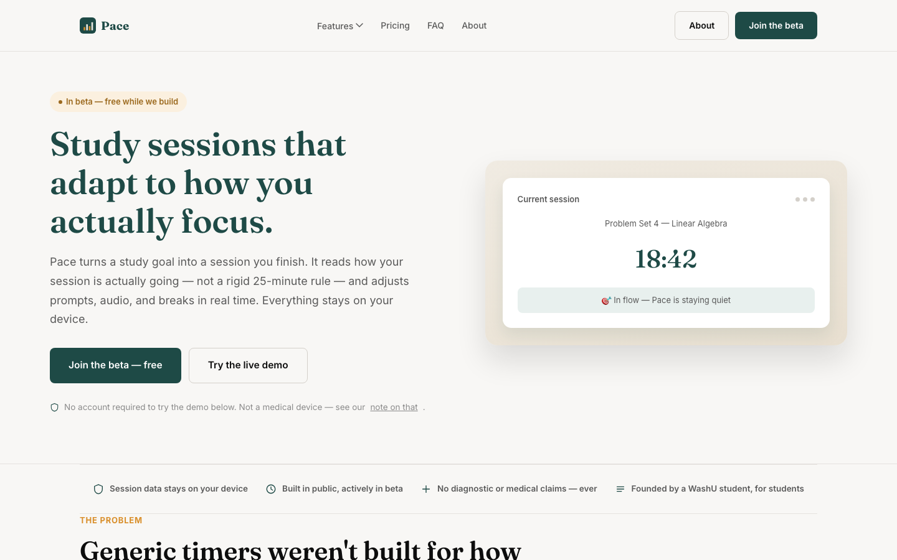

# Pace Website

[](README.md) [](README.zh-CN.md)

The public marketing website for Pace, a study-companion project for college students. This repository contains the website and an illustrative homepage demo—not the full Pace application, a medical tool, or a production signup backend.



## Preview locally

Requires a modern browser and Python 3 for the preview server and optional page generation. There are no npm dependencies or framework build steps.

```bash
git clone https://github.com/zhuhroscar-tech/pace-website.git
cd pace-website
python3 -m http.server 8000 --bind 127.0.0.1
```

Open `http://127.0.0.1:8000`. The committed HTML is ready to serve; rebuilding is only necessary after changing generator content or shared partials.

## What's included

- Homepage with an interactive study-session illustration and links to product information.
- About, pricing, FAQ, waitlist, and four feature pages.
- Shared navigation, mobile menu, FAQ accordion, and scroll-reveal effects.
- Plain HTML/CSS/JavaScript, plus Python helpers that generate secondary pages.

The waitlist currently offers an **email link**, with an explicit notice that the embedded signup form is not live. There is no working form backend to configure in this repository. Planned Pro features are product plans, not implemented application features here.

## Edit the right source

| Change | Source |
| --- | --- |
| Homepage content | `index.html` (hand-authored) |
| Shared header/footer | `src/partials/` |
| About, pricing, FAQ, waitlist copy | `build_pages.py` |
| Feature-page copy | `build_features.py` |
| Styles and browser behavior | `assets/css/`, `assets/js/site.js` |

After editing generated-page sources or partials:

```bash
python3 build_features.py
python3 build_pages.py
```

Review the generated HTML before committing. The hand-authored homepage is not rebuilt by these commands, so keep its navigation consistent separately. To add a real embedded waitlist form, replace the pending block in `build_pages.py` and regenerate; do not rely on a local setup file outside this repository.

## Deployment and checks

Serve the repository root with any static host. For GitHub Pages, select **Deploy from a branch → main → /(root)**. A configured deployment uses `https://<username>.github.io/pace-website/`; this README does not assume Pages is enabled.

Before publishing, check mobile navigation, internal links, the demo, FAQ keyboard interaction, and the waitlist email action. Google Fonts are loaded externally. Keep medical disclaimers intact and distinguish product plans from shipped behavior.
